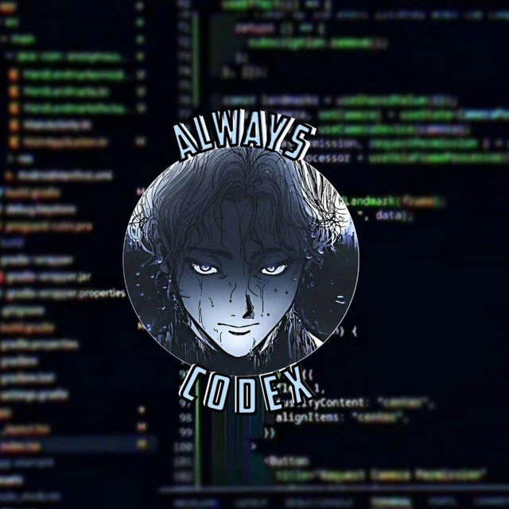

# <div align='center'>WhatsApp Web API</div>

<div align='center'>



</div>

[](https://github.com/AlwaysCodex/baileys/stargazers)
[](https://github.com/AlwaysCodex/baileys/network)
[](https://raw.githubusercontent.com/AlwaysCodex/baileys/master/LICENSE)

**@AlwaysCodex/baileys** is a fast, stable, and modern interactive-feature-focused WhatsApp Web API library built on WebSocket.

> This project is not affiliated with WhatsApp. Use it responsibly.

## License

This project is licensed under the [MIT License](https://raw.githubusercontent.com/AlwaysCodex/baileys/master/LICENSE).

Copyright (c) 2026 AlwaysCodex

## Install

```bash
npm install @AlwaysCodex/baileys
```

## Optional Dependencies

Install only what you need:

```bash
# Image processing (one of):
npm install jimp        # ^0.16 || ^0.22 || ^1.x
npm install sharp       # ^0.34 (recommended, faster)

# Audio metadata (ESM-only, loaded via dynamic import)
npm install music-metadata  # ^11

# Audio waveform (ESM-only, loaded via dynamic import)
npm install audio-decode    # ^2 || ^3

# Link preview
npm install link-preview-js # ^3 || ^4

# QR code in terminal
npm install qrcode-terminal # ^0.12

# SQLite auth store
npm install better-sqlite3  # ^11 || ^12
```

## Import

```js
const {
  default: makeWASocket,
  useMultiFileAuthState,
  DisconnectReason,
  fetchLatestWaWebVersion,
  makeInMemoryStore,
  Browsers,
  getContentType,
  downloadMediaMessage,
  getAggregateVotesInPollMessage
} = require('@AlwaysCodex/baileys')
```

## Index

- [Connecting Account](#connecting-account)
- [Socket Config](#socket-config)
- [Save Auth Info](#save-auth-info)
- [Handling Events](#handling-events)
- [Data Store](#data-store)
- [WhatsApp IDs](#whatsapp-ids)
- [Utility Functions](#utility-functions)
- [Sending Messages](#sending-messages)
- [Receiving Button Responses](#receiving-button-responses)
- [Kirim Button & Interactive Langsung dengan sendMessage](#kirim-button--interactive-langsung-dengan-sendmessage)
- [Modify Messages](#modify-messages)
- [Media Handling](#media-handling)
- [Read Receipts](#read-receipts)
- [Reject Call](#reject-call)
- [Presence](#presence)
- [Chat Modification](#chat-modification)
- [User Queries](#user-queries)
- [Profile](#profile)
- [Privacy Settings](#privacy-settings)
- [Block / Unblock](#block--unblock)
- [Groups](#groups)
- [Community](#community)
- [Newsletter / Channel](#newsletter--channel)
- [Business Profile](#business-profile)
- [Labels](#labels)
- [Bot Features](#bot-features)
- [New Message Types (WA 2.3000+)](#new-message-types-wa-23000)
- [WAProto Sync & Auto-Update](#waproto-sync--auto-update)
- [Call Link](#call-link)
- [Custom WS Callbacks](#custom-ws-callbacks)
- [Maintenance Mode](#maintenance-mode)
- [Feature Comparison](#feature-comparison)

---

## Connecting Account

### QR Code

```js
const { default: makeWASocket, Browsers } = require('@AlwaysCodex/baileys')

const sock = makeWASocket({
  browser: Browsers.windows('Alwayscodex'),
  printQRInTerminal: true
})
```

### Pairing Code

```js
const sock = makeWASocket({ printQRInTerminal: false })

if (!sock.authState.creds.registered) {
  const code = await sock.requestPairingCode('628xxxxxxxxxx')
  console.log('Pairing code:', code)
}
```

### Full History Sync

```js
const sock = makeWASocket({
  browser: Browsers.windows('Desktop'),
  syncFullHistory: true
})
```

### Auto Browser Detection

```js
const sock = makeWASocket({
  browser: Browsers.appropriate('Alwayscodex')
})
```

### Auto-Reconnect

```js
const { Boom } = require('@hapi/boom')

sock.ev.on('connection.update', ({ connection, lastDisconnect }) => {
  if (connection === 'close') {
    const shouldReconnect = (lastDisconnect?.error instanceof Boom)
      ? lastDisconnect.error.output.statusCode !== DisconnectReason.loggedOut
      : true
    if (shouldReconnect) connectToWhatsApp()
  }
})
```

---

## Socket Config

```js
const NodeCache = require('@cacheable/node-cache')
const groupCache = new NodeCache({ stdTTL: 5 * 60, useClones: false })

const sock = makeWASocket({
  auth: state,
  browser: Browsers.windows('Alwayscodex'),
  countryCode: 'US', // ISO 3166-1 alpha-2 (auto MCC fallback when mcc is not set)
  // mcc: '310', // optional explicit MCC override
  printQRInTerminal: true,
  syncFullHistory: false,
  markOnlineOnConnect: false,
  generateMessageID: () => require('crypto').randomBytes(16).toString('hex').toUpperCase(),
  cachedGroupMetadata: async (jid) => groupCache.get(jid),
  getMessage: async (key) => {
    const msg = await store.loadMessage(key.remoteJid, key.id)
    return msg?.message || undefined
  },
  linkPreviewImageThumbnailWidth: 192,
  generateHighQualityLinkPreview: true,
  enableRecentMessageCache: true,
  maxMsgRetryCount: 5,
  logger: require('pino')({ level: 'silent' })
})

sock.ev.on('groups.update', async ([event]) => {
  const metadata = await sock.groupMetadata(event.id)
  groupCache.set(event.id, metadata)
})
sock.ev.on('group-participants.update', async (event) => {
  const metadata = await sock.groupMetadata(event.id)
  groupCache.set(event.id, metadata)
})
```

`countryCode` now automatically resolves the user-agent MCC from the built-in phone-number MCC table when `mcc` is not explicitly provided.  
If you need a specific carrier/region MCC, set `mcc` manually.
If both `countryCode` and `mcc` are omitted, the fallback MCC defaults to `000` (with default country behavior using `US` internally).

---

## Save Auth Info

```js
const { useMultiFileAuthState } = require('@AlwaysCodex/baileys')

async function connectToWhatsApp() {
  const { state, saveCreds } = await useMultiFileAuthState('auth_info')
  const { version, isLatest } = await fetchLatestWaWebVersion()

  const sock = makeWASocket({ version, auth: state, printQRInTerminal: true })

  sock.ev.on('creds.update', saveCreds)
}
connectToWhatsApp()
```

---

## Handling Events

```js
sock.ev.on('connection.update', ({ connection, lastDisconnect, qr, isOnline }) => {
  console.log('Connection:', connection, '| Online:', isOnline)
})

sock.ev.on('messages.upsert', async ({ messages, type }) => {
  if (type !== 'notify') return
  for (const msg of messages) {
    console.log('New message from', msg.key.remoteJid)
  }
})

sock.ev.on('messages.update', (updates) => {
  for (const { key, update } of updates) {
    if (update.status) console.log('Status:', update.status)
  }
})

sock.ev.on('messages.delete', (item) => console.log('Deleted:', item))

sock.ev.on('message.reaction', ({ key, reaction }) => {
  console.log('Reaction', reaction.text, 'on', key.id)
})

sock.ev.on('chats.upsert', (chats) => console.log('Upsert', chats.length, 'chats'))
sock.ev.on('chats.update', (updates) => console.log('Chat updates:', updates))
sock.ev.on('chats.delete', (ids) => console.log('Chats deleted:', ids))

sock.ev.on('groups.update', (updates) => {
  for (const u of updates) console.log('Group updated:', u.id, u.subject)
})
sock.ev.on('group-participants.update', ({ id, participants, action }) => {
  console.log(action, 'in', id, ':', participants)
})

sock.ev.on('contacts.upsert', (contacts) => {
  for (const c of contacts) console.log('Contact:', c.id, c.notify)
})

sock.ev.on('presence.update', ({ id, presences }) => {
  for (const [participant, presence] of Object.entries(presences)) {
    console.log(participant, 'is', presence.lastKnownPresence)
  }
})

sock.ev.on('call', (calls) => {
  for (const call of calls) console.log('Call from', call.from, 'status:', call.status)
})
```

### Decrypt Poll Votes

```js
const { getAggregateVotesInPollMessage } = require('@AlwaysCodex/baileys')

sock.ev.on('messages.update', async (event) => {
  for (const { key, update } of event) {
    if (update.pollUpdates) {
      const pollCreation = await store.loadMessage(key.remoteJid, key.id)
      if (pollCreation) {
        const votes = getAggregateVotesInPollMessage({
          message: pollCreation.message,
          pollUpdates: update.pollUpdates
        })
        console.log('Poll results:', votes)
      }
    }
  }
})
```

---

## Data Store

```js
const { makeInMemoryStore } = require('@AlwaysCodex/baileys')

const store = makeInMemoryStore({})
store.readFromFile('./baileys_store.json')
setInterval(() => store.writeToFile('./baileys_store.json'), 10_000)

store.bind(sock.ev)

const msg = await store.loadMessage('628xxx@s.whatsapp.net', 'MESSAGE_ID')
const chats = store.chats.all()
```

---

## WhatsApp IDs

```
User JID   : [country][number]@s.whatsapp.net
Group JID  : [creator]-[timestamp]@g.us
Community  : [id]@g.us
Newsletter : [id]@newsletter
LID        : Modern identity-based identifier
```

```js
const {
  jidDecode,
  jidNormalizedUser,
  jidEncode,
  isJidGroup,
  isJidNewsletter,
  isJidUser,
  areJidsSameUser
} = require('@AlwaysCodex/baileys')

const { user, server, device } = jidDecode('628xxx@s.whatsapp.net')
const normalized = jidNormalizedUser('628xxx:10@s.whatsapp.net')
const jid = jidEncode('628xxx', 's.whatsapp.net')

isJidGroup('xxxx-xxxx@g.us')
isJidNewsletter('xxx@newsletter')
isJidUser('628xxx@s.whatsapp.net')
areJidsSameUser('628xxx@s.whatsapp.net', '628xxx:5@s.whatsapp.net')
```

---

## Utility Functions

```js
const {
  getContentType,
  downloadMediaMessage,
  generateMessageID,
  normalizeMessageContent,
  extractMessageContent
} = require('@AlwaysCodex/baileys')

const type = getContentType(msg.message)
const buffer = await downloadMediaMessage(msg, 'buffer', {})
const stream = await downloadMediaMessage(msg, 'stream', {})
const id = generateMessageID()
const content = normalizeMessageContent(msg.message)
```

### Account Restriction Check

```js
const restriction = await sock.checkAccountRestriction()
console.log(restriction.isRestricted, restriction.reachoutTimelock, restriction.messageCap)
```

### Audio Transcoding

```js
await sock.sendMessage(jid, {
  audio: { url: 'https://example.com/voice.mp3' },
  mimetype: 'audio/ogg; codecs=opus',
  ptt: true
}, {
  transcodeAudio: true,
  audioBitrate: '64k'
})
```

---

## Sending Messages

### Text

```js
await sock.sendMessage(jid, { text: 'Hello World!' })

await sock.sendMessage(jid, {
  text: '*bold* _italic_ ~strikethrough~ ```monospace```'
})

await sock.sendMessage(jid, {
  text: 'Check https://github.com/AlwaysCodex/baileys'
})

await sock.sendMessage(jid, { text: 'No preview', linkPreview: null })
```

### Quote / Reply

```js
await sock.sendMessage(jid, { text: 'Reply!' }, { quoted: msg })
```

### Mention Users

```js
await sock.sendMessage(jid, {
  text: 'Hello @628111111111 and @628222222222!',
  mentions: ['628111111111@s.whatsapp.net', '628222222222@s.whatsapp.net']
})
```

### Image

```js
await sock.sendMessage(jid, {
  image: { url: 'https://example.com/photo.jpg' },
  caption: 'Caption'
})

const fs = require('fs')
await sock.sendMessage(jid, {
  image: fs.readFileSync('./photo.jpg'),
  caption: 'From file'
})

await sock.sendMessage(jid, {
  image: Buffer.from('<base64_string>', 'base64'),
  caption: 'Base64'
})
```

### Video

```js
await sock.sendMessage(jid, {
  video: { url: 'https://example.com/video.mp4' },
  caption: 'Video'
})

await sock.sendMessage(jid, {
  video: { url: 'https://example.com/animation.mp4' },
  gifPlayback: true
})
```

### Audio / PTT

```js
await sock.sendMessage(jid, {
  audio: { url: 'https://example.com/audio.mp3' },
  mimetype: 'audio/mp4'
})

await sock.sendMessage(jid, {
  audio: { url: 'https://example.com/voice.ogg' },
  mimetype: 'audio/ogg; codecs=opus',
  ptt: true
})
```

### PTV

```js
await sock.sendMessage(jid, {
  video: { url: 'https://example.com/clip.mp4' },
  ptv: true
})
```

### Document

```js
await sock.sendMessage(jid, {
  document: { url: 'https://example.com/file.pdf' },
  mimetype: 'application/pdf',
  fileName: 'report.pdf',
  caption: 'Monthly report'
})
```

### Sticker

```js
await sock.sendMessage(jid, {
  sticker: { url: 'https://example.com/sticker.webp' }
})

await sock.sendMessage(jid, {
  sticker: fs.readFileSync('./sticker.tgs'),
  isLottie: true
})
```

### Sticker Pack

```js
// option 1
await sock.sendMessage(jid, {
  stickerPack: {
    stickerPackId: 'your-pack-id',
    name: 'My Sticker Pack',
    publisher: 'My Brand',
    stickers: [
      { stickerId: 'sticker-1', fileName: 'sticker1.webp', emoticon: '🔥' },
      { stickerId: 'sticker-2', fileName: 'sticker2.webp', emoticon: '✨' }
    ],
    packDescription: 'Sample sticker pack'
  }
})

// option 2 (alias)
await sock.sendMessage(jid, {
  stickerPackMessage: {
    stickerPackId: 'your-pack-id',
    name: 'My Sticker Pack',
    publisher: 'My Brand',
    stickers: [
      { stickerId: 'sticker-1', fileName: 'sticker1.webp', emoticon: '🔥' }
    ],
    packDescription: 'Sample sticker pack'
  }
})
```

> Note: `stickerPack` and `stickerPackMessage` are aliases. Use only one in a single message.

### Contact Card

```js
await sock.sendMessage(jid, {
  contacts: {
    displayName: 'John Doe',
    contacts: [
      {
        vcard: `BEGIN:VCARD
VERSION:3.0
FN:John Doe
TEL;type=CELL;type=VOICE;waid=628111111111:+62 811-1111-1111
END:VCARD`
      }
    ]
  }
})

await sock.sendMessage(jid, {
  contacts: {
    displayName: '2 Contacts',
    contacts: [
      { vcard: 'BEGIN:VCARD\nVERSION:3.0\nFN:Alice\nTEL;waid=628111111111:+62811\nEND:VCARD' },
      { vcard: 'BEGIN:VCARD\nVERSION:3.0\nFN:Bob\nTEL;waid=628222222222:+62822\nEND:VCARD' }
    ]
  }
})
```

### Location

```js
await sock.sendMessage(jid, {
  location: {
    degreesLatitude: -6.2088,
    degreesLongitude: 106.8456,
    name: 'Jakarta, Indonesia',
    address: 'DKI Jakarta, Indonesia'
  }
})
```

### Live Location

```js
await sock.sendMessage(jid, {
  liveLocation: {
    degreesLatitude: -6.2088,
    degreesLongitude: 106.8456,
    accuracyInMeters: 10,
    speedInMps: 0,
    degreesClockwiseFromMagneticNorth: 0,
    sequenceNumber: BigInt(Date.now()),
    timeSinceLastUpdate: 0
  },
  caption: 'Live location'
})
```

### Poll

```js
await sock.sendMessage(jid, {
  poll: {
    name: 'Favorite color?',
    values: ['Red', 'Green', 'Blue'],
    selectableCount: 1
  }
})

await sock.sendMessage(jid, {
  poll: {
    name: 'Select hobbies:',
    values: ['Gaming', 'Reading', 'Coding'],
    selectableCount: 0
  }
})
```

### Reaction

```js
await sock.sendMessage(jid, { react: { text: 'ok', key: msg.key } })

await sock.sendMessage(jid, { react: { text: '', key: msg.key } })
```

### List Message

```js
await sock.sendMessage(jid, {
  title: 'Order Menu',
  text: 'Please select from the options below:',
  footer: 'Powered by Alwayscodex',
  buttonText: 'Open Menu',
  sections: [
    {
      title: 'Main Course',
      rows: [
        { title: 'Pizza', description: 'Classic tomato', rowId: 'pizza'  },
        { title: 'Burger', description: 'Double beef',   rowId: 'burger' }
      ]
    },
    {
      title: 'Drinks',
      rows: [
        { title: 'Cola',   description: '500ml',          rowId: 'cola'  },
        { title: 'Juice',  description: 'Fresh squeezed', rowId: 'juice' }
      ]
    }
  ]
})

await sock.sendMessage(jid, {
  listMessage: {
    title: 'Order Menu',
    description: 'Please select from the options below:',
    footerText: 'Powered by Alwayscodex',
    buttonText: 'Open Menu',
    listType: 1,
    sections: [
      {
        title: 'Food',
        rows: [
          { title: 'Fried Rice', description: 'Tasty', rowId: 'fried_rice' }
        ]
      }
    ]
  }
})
```

### Buttons Message

```js
await sock.sendMessage(jid, {
  text: 'What would you like to do?',
  footer: 'Alwayscodex Bot',
  buttons: [
    { buttonId: 'id1', buttonText: { displayText: 'View Menu'   } },
    { buttonId: 'id2', buttonText: { displayText: 'Place Order' } },
    { buttonId: 'id3', buttonText: { displayText: 'Help'        } }
  ]
})

await sock.sendMessage(jid, {
  image: { url: 'https://example.com/banner.jpg' },
  caption: 'Choose an option:',
  footer: 'Alwayscodex',
  buttons: [
    { buttonId: 'yes', buttonText: { displayText: 'Yes' } },
    { buttonId: 'no',  buttonText: { displayText: 'No'  } }
  ]
})

// gifted-style shortcuts are also supported
await sock.sendMessage(jid, {
  text: 'Choose one',
  buttons: [
    { id: 'a', text: 'Option A' },
    { id: 'b', displayText: 'Option B' },
    { buttonId: 'c', buttonText: 'Option C' }
  ]
})

await sock.sendMessage(jid, {
  buttonsMessage: {
    contentText: 'Legacy buttons message',
    footerText: 'Alwayscodex Legacy',
    buttons: [
      { buttonId: 'legacy_1', buttonText: { displayText: 'Legacy 1' }, type: 1 },
      { buttonId: 'legacy_2', buttonText: { displayText: 'Legacy 2' }, type: 1 }
    ],
    headerType: 1
  }
})
```

### Interactive Message

```js
await sock.sendMessage(jid, {
  interactiveMessage: {
    header: { title: 'Quick Question', hasMediaAttachment: false },
    body:   { text: 'Are you enjoying alwayscodex?' },
    footer: { text: 'alwayscodex' },
    nativeFlowMessage: {
      buttons: [
        { name: 'quick_reply', buttonParamsJson: JSON.stringify({ display_text: 'Yes!',    id: 'yes'   }) },
        { name: 'quick_reply', buttonParamsJson: JSON.stringify({ display_text: 'Not yet', id: 'no'    }) },
        { name: 'quick_reply', buttonParamsJson: JSON.stringify({ display_text: 'Maybe',   id: 'maybe' }) }
      ],
      messageParamsJson: ''
    }
  }
})

// PIX button — works on both WhatsApp Web and mobile
await sock.sendMessage(jid, {
  text: '',
  interactiveButtons: [
    {
      name: 'payment_info',
      buttonParamsJson: JSON.stringify({
        payment_settings: [{
          type: 'pix_static_code',
          pix_static_code: {
            merchant_name: 'Your Name',
            key: 'example@email.com',
            key_type: 'EMAIL' // PHONE | EMAIL | CPF | EVP
          }
        }]
      })
    }
  ]
})

// PAY button — works on both WhatsApp Web and mobile
await sock.sendMessage(jid, {
  text: '',
  interactiveButtons: [
    {
      name: 'review_and_pay',
      buttonParamsJson: JSON.stringify({
        currency: 'IDR',
        payment_configuration: '',
        payment_type: '',
        total_amount: { value: '10000', offset: '100' },
        reference_id: 'REF-001',
        type: 'physical-goods',
        payment_method: 'confirm',
        payment_status: 'captured',
        payment_timestamp: Math.floor(Date.now() / 1000),
        order: {
          status: 'completed',
          description: '',
          subtotal: { value: '0', offset: '100' },
          order_type: 'PAYMENT_REQUEST',
          items: [{
            retailer_id: 'your_retailer_id',
            name: 'Product Name',
            amount: { value: '10000', offset: '100' },
            quantity: '1'
          }]
        },
        additional_note: 'Thank you',
        native_payment_methods: [],
        share_payment_status: false
      })
    }
  ]
})

await sock.sendMessage(jid, {
  interactiveMessage: {
    header: { title: 'Visit Our Website', hasMediaAttachment: false },
    body:   { text: 'Click the button below.' },
    footer: { text: 'alwayscodex' },
    nativeFlowMessage: {
      buttons: [
        {
          name: 'cta_url',
          buttonParamsJson: JSON.stringify({
            display_text: 'Open Website',
            url: 'https://github.com/AlwaysCodex/baileys',
            merchant_url: 'https://github.com/AlwaysCodex/baileys'
          })
        }
      ],
      messageParamsJson: ''
    }
  }
})

await sock.sendMessage(jid, {
  interactiveMessage: {
    header: { title: 'Your Promo Code', hasMediaAttachment: false },
    body:   { text: 'Use the promo code below for 20% off.' },
    footer: { text: 'alwayscodex Shop' },
    nativeFlowMessage: {
      buttons: [
        {
          name: 'cta_copy',
          buttonParamsJson: JSON.stringify({
            display_text: 'Copy Code',
            id: 'promo_code',
            copy_code: 'ALWAYSCODEX20'
          })
        }
      ],
      messageParamsJson: ''
    }
  }
})

await sock.sendMessage(jid, {
  interactiveMessage: {
    header: { title: 'Select a Plan', hasMediaAttachment: false },
    body:   { text: 'Choose your subscription plan:' },
    footer: { text: 'alwayscodex Services' },
    nativeFlowMessage: {
      buttons: [
        {
          name: 'single_select',
          buttonParamsJson: JSON.stringify({
            title: 'Available Plans',
            sections: [
              {
                title: 'Plans',
                rows: [
                  { header: 'Free',    title: 'Free Plan',     description: 'Basic features', id: 'free'    },
                  { header: 'Basic',   title: 'Basic - $5',    description: 'More features',  id: 'basic'   },
                  { header: 'Premium', title: 'Premium - $20', description: 'All features',   id: 'premium' }
                ]
              }
            ]
          })
        }
      ],
      messageParamsJson: ''
    }
  }
})

await sock.sendMessage(jid, {
  interactiveMessage: {
    header: { title: 'Special Offer', hasMediaAttachment: false },
    body:   { text: 'Choose an action:' },
    footer: { text: 'alwayscodex Bot' },
    nativeFlowMessage: {
      buttons: [
        {
          name: 'cta_url',
          buttonParamsJson: JSON.stringify({
            display_text: 'Open Website',
            url: 'https://github.com/AlwaysCodex/baileys',
            merchant_url: 'https://github.com/AlwaysCodex/baileys'
          })
        },
        {
          name: 'cta_copy',
          buttonParamsJson: JSON.stringify({ display_text: 'Copy Code', id: 'code', copy_code: 'ALWAYSCODEX50' })
        },
        {
          name: 'quick_reply',
          buttonParamsJson: JSON.stringify({ display_text: 'Continue', id: 'continue' })
        }
      ],
      messageParamsJson: ''
    }
  }
}, { quoted: msg })

await sock.sendMessage(jid, {
  interactiveMessage: {
    header: {
      title: 'Choose option',
      hasMediaAttachment: true,
      imageMessage: { url: 'https://example.com/banner.jpg', mimetype: 'image/jpeg' }
    },
    body:   { text: 'Choose:' },
    footer: { text: 'alwayscodex' },
    nativeFlowMessage: {
      buttons: [
        { name: 'quick_reply', buttonParamsJson: JSON.stringify({ display_text: 'Yes', id: 'yes' }) },
        { name: 'quick_reply', buttonParamsJson: JSON.stringify({ display_text: 'No',  id: 'no'  }) }
      ],
      messageParamsJson: ''
    }
  }
})

await sock.sendMessage(jid, {
  interactiveMessage: {
    header: { title: 'Main Menu', hasMediaAttachment: false },
    body:   { text: 'Please choose a menu:' },
    footer: { text: 'alwayscodex' },
    nativeFlowMessage: {
      buttons: [
        {
          name: 'single_select',
          buttonParamsJson: JSON.stringify({
            title: 'Choose Category',
            sections: [
              {
                title: 'Food',
                rows: [
                  { title: 'Fried Rice', description: 'Tasty', id: 'fried_rice' },
                  { title: 'Chicken Noodles', description: 'Large', id: 'chicken_noodles' }
                ]
              }
            ],
            has_multiple_buttons: true
          })
        },
        {
          name: 'quick_reply',
          buttonParamsJson: JSON.stringify({ display_text: 'Close', id: 'close', has_multiple_buttons: true })
        }
      ],
      messageParamsJson: ''
    }
  }
}, { quoted: msg })

const fs = require('fs')
await sock.sendMessage(jid, {
  interactiveMessage: {
    header: 'Important Document',
    title: 'PDF File',
    footer: 'alwayscodex',
    document: fs.readFileSync('./file.pdf'),
    mimetype: 'application/pdf',
    fileName: 'document.pdf',
    jpegThumbnail: fs.readFileSync('./thumb.jpg'),
    contextInfo: {
      mentionedJid: [jid],
      forwardingScore: 777,
      isForwarded: false
    },
    externalAdReply: {
      title: 'alwayscodex Bot',
      body: 'Interactive bot',
      mediaType: 3,
      thumbnailUrl: 'https://example.com/thumb.jpg',
      sourceUrl: 'https://github.com/AlwaysCodex/baileys',
      showAdAttribution: true,
      renderLargerThumbnail: false
    },
    buttons: [
      {
        name: 'cta_url',
        buttonParamsJson: JSON.stringify({
          display_text: 'Open Link',
          url: 'https://github.com/AlwaysCodex/baileys',
          merchant_url: 'https://github.com/AlwaysCodex/baileys'
        })
      }
    ]
  }
}, { quoted: msg })

await sock.sendMessage(jid, {
  interactiveMessage: {
    header: 'Hello World',
    title: 'Hello World',
    footer: 'alwayscodex',
    image: { url: 'https://example.com/image.jpg' },
    nativeFlowMessage: {
      messageParamsJson: JSON.stringify({
        limited_time_offer: {
          text: 'Limited offer',
          url: 'https://github.com/AlwaysCodex/baileys',
          copy_code: 'ALWAYSCODEX',
          expiration_time: Date.now() + 3600000
        },
        bottom_sheet: {
          in_thread_buttons_limit: 2,
          list_title: 'alwayscodex',
          button_title: 'alwayscodex'
        }
      }),
      buttons: [
        {
          name: 'single_select',
          buttonParamsJson: JSON.stringify({
            title: 'Hello World',
            sections: [
              {
                title: 'Options',
                highlight_label: 'label',
                rows: [
                  { title: 'Option 1', description: 'First option', id: 'opt1' }
                ]
              }
            ],
            has_multiple_buttons: true
          })
        },
        {
          name: 'call_permission_request',
          buttonParamsJson: JSON.stringify({ has_multiple_buttons: true })
        },
        {
          name: 'cta_copy',
          buttonParamsJson: JSON.stringify({ display_text: 'Copy Code', id: 'code', copy_code: 'ALWAYSCODEX' })
        }
      ]
    }
  }
}, { quoted: msg })

// Reminder button
await sock.sendMessage(jid, {
  interactiveMessage: {
    header: { title: 'Set Reminder', hasMediaAttachment: false },
    body:   { text: 'Reminder for the meeting' },
    footer: { text: 'alwayscodex' },
    nativeFlowMessage: {
      buttons: [
        { name: 'cta_reminder', buttonParamsJson: JSON.stringify({ display_text: 'Remind Me', id: 'reminder_1' }) },
        { name: 'cta_cancel_reminder', buttonParamsJson: JSON.stringify({ display_text: 'Cancel Reminder', id: 'cancel_1' }) }
      ],
      messageParamsJson: ''
    }
  }
})

// Address button
await sock.sendMessage(jid, {
  interactiveMessage: {
    header: { title: 'Delivery', hasMediaAttachment: false },
    body:   { text: 'Enter your delivery address' },
    footer: { text: 'alwayscodex' },
    nativeFlowMessage: {
      buttons: [
        { name: 'address_message', buttonParamsJson: JSON.stringify({ display_text: 'Set Address', id: 'addr_1' }) }
      ],
      messageParamsJson: ''
    }
  }
})

// Location button
await sock.sendMessage(jid, {
  interactiveMessage: {
    header: { title: 'Share Location', hasMediaAttachment: false },
    body:   { text: 'Send your current location' },
    footer: { text: 'alwayscodex' },
    nativeFlowMessage: {
      buttons: [
        { name: 'send_location', buttonParamsJson: '' }
      ],
      messageParamsJson: ''
    }
  }
})
```

### Carousel Message

```js
await sock.sendMessage(jid, {
  interactiveMessage: {
    body: { text: 'Browse our products:' },
    footer: { text: 'Swipe to see more' },
    carouselMessage: {
      cards: [
        {
          header: {
            imageMessage: { url: 'https://example.com/product1.jpg', mimetype: 'image/jpeg' },
            hasMediaAttachment: true
          },
          body:   { text: 'Product 1 – Best seller' },
          footer: { text: 'Rp 99.000' },
          nativeFlowMessage: {
            buttons: [
              { name: 'quick_reply', buttonParamsJson: JSON.stringify({ display_text: 'Buy Now', id: 'buy_1' }) }
            ],
            messageParamsJson: ''
          }
        },
        {
          header: {
            imageMessage: { url: 'https://example.com/product2.jpg', mimetype: 'image/jpeg' },
            hasMediaAttachment: true
          },
          body:   { text: 'Product 2 – New arrival' },
          footer: { text: 'Rp 149.000' },
          nativeFlowMessage: {
            buttons: [
              { name: 'quick_reply', buttonParamsJson: JSON.stringify({ display_text: 'Buy Now', id: 'buy_2' }) }
            ],
            messageParamsJson: ''
          }
        }
      ]
    }
  }
})
```

### Album Message

```js
await sock.sendAlbumMessage(jid, [
  { image: { url: 'https://picsum.photos/800/600?1' }, caption: 'Photo 1' },
  { image: { url: 'https://picsum.photos/800/600?2' }, caption: 'Photo 2' },
  { video: { url: 'https://example.com/clip.mp4' },    caption: 'Video 1' }
], { delay: 300 })

await sock.sendMessage(jid, {
  album: [
    { image: { url: 'https://picsum.photos/800/600?1' } },
    { image: { url: 'https://picsum.photos/800/600?2' } }
  ]
})
```

### Forward Message

```js
await sock.sendMessage(jid, { forward: msg })
await sock.sendMessage(jid, { forward: msg, force: true })
```

### Event Message

```js
await sock.sendMessage(jid, {
  event: {
    isCanceled: false,
    name: 'Team Meeting',
    description: 'Weekly sync',
    location: { degreesLatitude: -6.2088, degreesLongitude: 106.8456, name: 'Jakarta' },
    joinLink: 'https://call.whatsapp.com/video/xxx',
    startTime: String(Math.floor(Date.now() / 1000) + 3600),
    endTime: String(Math.floor(Date.now() / 1000) + 7200),
    extraGuestsAllowed: false
  }
})
```

### Poll Result Message

```js
await sock.sendMessage(jid, {
  pollResult: {
    name: 'Favorite color?',
    values: [
      ['Red',   112],
      ['Green',  45],
      ['Blue',  233]
    ]
  }
})
```

### Group Status Message

```js
// raw object
await sock.sendMessage(jid, {
  groupStatusMessage: { text: 'Hello group!' }
})

// flag wrapper (wraps any message in groupStatusMessage)
await sock.sendMessage(jid, {
  image: { url: './photo.jpg' },
  caption: 'Group status!',
  groupStatus: true
})
```

### View Once Variants

```js
// viewOnce
await sock.sendMessage(jid, {
  image: { url: './photo.jpg' },
  viewOnce: true
})

// viewOnceMessageV2
await sock.sendMessage(jid, {
  image: { url: './photo.jpg' },
  viewOnceV2: true
})

// viewOnceMessageV2Extension
await sock.sendMessage(jid, {
  image: { url: './photo.jpg' },
  viewOnceV2Extension: true
})
```

### Ephemeral Wrapper

```js
await sock.sendMessage(jid, {
  image: { url: './photo.jpg' },
  caption: 'Ephemeral message',
  ephemeral: true
})
```

### Interactive as Template

```js
await sock.sendMessage(jid, {
  text: 'Choose an option',
  buttons: [{ id: 'a', text: 'Option A' }],
  interactiveAsTemplate: true
})
```

### Kirim Button & Interactive Langsung dengan sendMessage

Semua jenis button/interactive bisa dikirim langsung pakai `sock.sendMessage()` tanpa builder. Lihat contoh lengkap di bagian:

- **Buttons Message** → [lihat di atas](#buttons-message)
- **Interactive Message (native flow)** → [lihat di atas](#interactive-message)
- **List Message** → [lihat di atas](#list-message)
- **Carousel Message** → [lihat di atas](#carousel-message)

#### Contoh Cepat:

```js
// Buttons biasa
await sock.sendMessage(jid, {
  text: 'What would you like to do?',
  footer: 'Alwayscodex Bot',
  buttons: [
    { buttonId: 'id1', buttonText: { displayText: 'View Menu' } },
    { buttonId: 'id2', buttonText: { displayText: 'Place Order' } },
  ]
})

// Interactive native flow (quick reply)
await sock.sendMessage(jid, {
  interactiveMessage: {
    header: { title: 'Quick Question', hasMediaAttachment: false },
    body: { text: 'Are you enjoying Alwayscodex?' },
    footer: { text: 'alwayscodex' },
    nativeFlowMessage: {
      buttons: [
        { name: 'quick_reply', buttonParamsJson: JSON.stringify({ display_text: 'Yes!', id: 'yes' }) },
        { name: 'quick_reply', buttonParamsJson: JSON.stringify({ display_text: 'Not yet', id: 'no' }) },
      ],
      messageParamsJson: ''
    }
  }
})

// List message
await sock.sendMessage(jid, {
  title: 'Order Menu',
  text: 'Please select:',
  footer: 'Alwayscodex',
  buttonText: 'Open Menu',
  sections: [
    {
      title: 'Food',
      rows: [
        { title: 'Pizza', description: 'Classic', rowId: 'pizza' },
        { title: 'Burger', description: 'Double', rowId: 'burger' },
      ]
    }
  ]
})

// Interactive dengan URL button
await sock.sendMessage(jid, {
  interactiveMessage: {
    header: { title: 'Visit Us', hasMediaAttachment: false },
    body: { text: 'Click the button below.' },
    footer: { text: 'alwayscodex' },
    nativeFlowMessage: {
      buttons: [{
        name: 'cta_url',
        buttonParamsJson: JSON.stringify({
          display_text: 'Open Website',
          url: 'https://github.com/AlwaysCodex/baileys',
        })
      }],
      messageParamsJson: ''
    }
  }
})

// Interactive dengan single select (dropdown)
await sock.sendMessage(jid, {
  interactiveMessage: {
    header: { title: 'Select Plan', hasMediaAttachment: false },
    body: { text: 'Choose your subscription:' },
    footer: { text: 'alwayscodex Services' },
    nativeFlowMessage: {
      buttons: [{
        name: 'single_select',
        buttonParamsJson: JSON.stringify({
          title: 'Available Plans',
          sections: [{
            title: 'Plans',
            rows: [
              { header: 'Free', title: 'Free Plan', description: 'Basic', id: 'free' },
              { header: 'Pro', title: 'Pro - $15', description: 'All features', id: 'pro' },
            ]
          }]
        })
      }],
      messageParamsJson: ''
    }
  }
})

// Interactive dengan copy code button
await sock.sendMessage(jid, {
  interactiveMessage: {
    header: { title: 'Your Promo Code', hasMediaAttachment: false },
    body: { text: 'Use the code below for 20% off.' },
    footer: { text: 'alwayscodex Shop' },
    nativeFlowMessage: {
      buttons: [{
        name: 'cta_copy',
        buttonParamsJson: JSON.stringify({
          display_text: 'Copy Code',
          copy_code: 'ALWAYSCODEX20'
        })
      }],
      messageParamsJson: ''
    }
  }
})

// Carousel / Image Slide
await sock.sendMessage(jid, {
  interactiveMessage: {
    body: { text: 'Browse our products:' },
    footer: { text: 'Swipe to see more' },
    carouselMessage: {
      cards: [
        {
          header: {
            imageMessage: { url: 'https://example.com/product1.jpg', mimetype: 'image/jpeg' },
            hasMediaAttachment: true
          },
          body: { text: 'Product 1' },
          footer: { text: 'Rp 99.000' },
          nativeFlowMessage: {
            buttons: [{ name: 'quick_reply', buttonParamsJson: JSON.stringify({ display_text: 'Buy', id: 'buy_1' }) }],
            messageParamsJson: ''
          }
        }
      ]
    }
  }
})
```

> 💡 **Lihat bagian [Interactive Message](#interactive-message) di atas untuk contoh lebih lengkap** (PIX button, PAY button, reminder, address, location, media header, dll).

### External Ad Reply (all message types)

```js
await sock.sendMessage(jid, {
  text: 'Check this out',
  externalAdReply: {
    title: 'My App',
    body: 'Click to open',
    thumbnail: fs.readFileSync('./thumb.jpg'),
    largeThumbnail: false,
    url: 'https://example.com',
    showAdAttribution: true
  }
})

// snake_case compatibility aliases are supported too
await sock.sendMessage(jid, {
  text: 'Alias compatibility',
  externalAdReply: {
    title: 'My App',
    body: 'Open now',
    media_type: 1,
    thumbnail_url: 'https://example.com/thumb.jpg',
    source_url: 'https://example.com',
    show_ad_attribution: true,
    render_larger_thumbnail: false
  }
})
```

### Secure Meta Service Label

```js
await sock.sendMessage(jid, {
  text: 'Just a label!',
  secureMetaServiceLabel: true
})
```

### Raw Proto (manual)

```js
await sock.sendMessage(jid, {
  extendedTextMessage: {
    text: 'Built from raw proto',
    contextInfo: {
      externalAdReply: {
        title: 'alwayscodex',
        jpegThumbnail: fs.readFileSync('./thumb.jpg'),
        sourceApp: 'whatsapp',
        showAdAttribution: true,
        mediaType: 1
      }
    }
  },
  raw: true
})
```

### Payment Request

> ⚠️ **WA Web only** — Payment request messages are only fully functional on WhatsApp Web. Sending via the mobile app may cause unexpected behaviour or force-close.

```js
// simple shorthand - requestFrom is who should pay
await sock.sendMessage(jid, {
  text: 'Payment for subscription',
  requestPaymentFrom: jid    // jid of the person who should pay
})

// full control
await sock.sendMessage(jid, {
  requestPayment: {
    currency: 'IDR',
    amount: 100000 * 1000,   // amount in thousandths of currency unit
    from: jid,               // JID of who should pay (not the bot's own JID)
    note: 'Payment for subscription'
  }
})

await sock.sendMessage(jid, {
  requestPaymentMessage: {
    currencyCodeIso4217: 'IDR',
    amount1000: 100000 * 1000,
    requestFrom: jid,
    noteMessage: {
      extendedTextMessage: { text: 'Payment for subscription' }
    }
  }
})

await sock.sendMessage(jid, {
  requestPayment: {
    currency: 'IDR',
    amount: 50000 * 1000,
    from: jid,
    background: {
      id: '100',
      fileLength: '0',
      width: 1000,
      height: 1000,
      mimetype: 'image/webp',
      placeholderArgb: 0xFF00FFFF,
      textArgb: 0xFFFFFFFF,
      subtextArgb: 0xFFAA00FF
    }
  }
})
```

### Send Payment (respond to a request)

> ⚠️ **WA Web only** — Send payment payload rendering depends on WhatsApp Web support.

```js
await sock.sendMessage(jid, {
  sendPayment: {
    requestMessageKey: reqMsg.key, // key dari pesan requestPayment yang mau dibayar
    note: 'Paid, thank you!',
    transactionData: 'opaque-transaction-payload'
  }
})

// raw/proto-compatible form
await sock.sendMessage(jid, {
  sendPaymentMessage: {
    requestMessageKey: reqMsg.key,
    noteMessage: {
      extendedTextMessage: { text: 'Paid via transfer' }
    }
  }
})
```

### Decline / Cancel Payment Request

```js
// decline request from the payer side
await sock.sendMessage(jid, {
  declinePaymentRequest: reqMsg.key
})

// cancel request from the requester side
await sock.sendMessage(jid, {
  cancelPaymentRequest: reqMsg.key
})
```

### Payment Invite

> ⚠️ **WA Web only** — Payment invite messages (GPay / PhonePe / Meta Pay) are only rendered on WhatsApp Web.

```js
// serviceType: 1 = GPay, 2 = PhonePe, 3 = Meta Pay
await sock.sendMessage(jid, {
  paymentInviteServiceType: 3,
  paymentInviteExpiry: Math.floor(Date.now() / 1000) + 86400
})

// alias object form
await sock.sendMessage(jid, {
  paymentInvite: {
    type: 3,
    expiry: Math.floor(Date.now() / 1000) + 86400
  }
})
```

### Invoice

```js
await sock.sendMessage(jid, {
  image: { url: './invoice.jpg' },
  invoiceNote: 'Invoice #1234'
})
```

### Order (simple)

```js
await sock.sendMessage(jid, {
  orderText: 'Your order is ready!',
  thumbnail: fs.readFileSync('./product.jpg')
}, { quoted: message })
```

### Order (full)

```js
await sock.sendMessage(jid, {
  order: {
    id: 'ORD-1001',
    thumbnail: fs.readFileSync('./product.jpg'),
    itemCount: 2,
    status: 1,
    surface: 1,
    title: 'Order Confirmation',
    text: 'Thanks for your purchase!',
    seller: '628111111111@s.whatsapp.net',
    token: 'order-token',
    amount: 150000 * 1000,
    currency: 'IDR'
  }
})
```

### Product Message

```js
await sock.sendMessage(jid, {
  product: {
    productImage: { url: 'https://example.com/product.jpg' },
    productId: 'prod-1',
    title: 'Premium Coffee Beans',
    description: 'Roasted arabica',
    currencyCode: 'IDR',
    priceAmount1000: '120000000',
    retailerId: 'sku-001',
    productImageCount: 1
  },
  businessOwnerJid: '628111111111@s.whatsapp.net'
})
```

### Product List Message

```js
await sock.sendMessage(jid, {
  title: 'Catalog',
  text: 'Choose a product',
  footer: 'Alwayscodex Shop',
  buttonText: 'View Products',
  businessOwnerJid: '628111111111@s.whatsapp.net',
  productList: [
    {
      title: 'Best Seller',
      products: [
        { productId: 'prod-1' },
        { productId: 'prod-2' }
      ]
    }
  ]
})
```

### Shop Interactive

```js
await sock.sendMessage(jid, {
  text: 'Open storefront',
  footer: 'Alwayscodex Store',
  shop: {
    id: '628111111111@s.whatsapp.net',
    surface: 1
  }
})
```

### Template Buttons (legacy)

```js
await sock.sendMessage(jid, {
  text: 'Choose action',
  footer: 'Alwayscodex',
  templateButtons: [
    { index: 1, quickReplyButton: { displayText: 'Ping', id: 'ping' } },
    { index: 2, urlButton: { displayText: 'Website', url: 'https://github.com/AlwaysCodex/baileys' } }
  ]
})
```

### Interactive Buttons — Full All Types (shorthand)

Kirim semua jenis button native flow dalam satu `conn.sendMessage()`:

```js
await conn.sendMessage(m.chat, {
  text: "This is an Interactive message!",
  title: "Hiii",
  subtitle: "There is a subtitle",
  footer: "Hello World!",
  interactiveButtons: [
    {
      name: "quick_reply",
      buttonParamsJson: JSON.stringify({
        display_text: "Click Me!",
        id: "your_id",
      }),
    },
    {
      name: "cta_url",
      buttonParamsJson: JSON.stringify({
        display_text: "Follow Me",
        url: "https://whatsapp.com/channel/0029Vb7JPWCAInPfKWC14s2V",
      }),
    },
    {
      name: "cta_copy",
      buttonParamsJson: JSON.stringify({
        display_text: "Copy Link",
        copy_code: "https://whatsapp.com/channel/0029Vb7JPWCAInPfKWC14s2V",
      }),
    },
    {
      name: "cta_call",
      buttonParamsJson: JSON.stringify({
        display_text: "Call Me!",
        phone_number: "628xxx",
      }),
    },
    {
      name: "cta_catalog",
      buttonParamsJson: JSON.stringify({
        business_phone_number: "628xxx",
      }),
    },
    {
      name: "cta_reminder",
      buttonParamsJson: JSON.stringify({
        display_text: "Set Reminder",
      }),
    },
    {
      name: "cta_cancel_reminder",
      buttonParamsJson: JSON.stringify({
        display_text: "Cancel Reminder",
      }),
    },
    {
      name: "address_message",
      buttonParamsJson: JSON.stringify({
        display_text: "Send Address",
      }),
    },
    {
      name: "send_location",
      buttonParamsJson: JSON.stringify({
        display_text: "Send Location",
      }),
    },
    {
      name: "open_webview",
      buttonParamsJson: JSON.stringify({
        title: "Follow Me!",
        link: {
          in_app_webview: true,
          url: "https://whatsapp.com/channel/0029Vb7JPWCAInPfKWC14s2V",
        },
      }),
    },
    {
      name: "mpm",
      buttonParamsJson: JSON.stringify({
        product_id: "8816262248471474",
      }),
    },
    {
      name: "wa_payment_transaction_details",
      buttonParamsJson: JSON.stringify({
        transaction_id: "12345848",
      }),
    },
    {
      name: "automated_greeting_message_view_catalog",
      buttonParamsJson: JSON.stringify({
        business_phone_number: "628xxx",
        catalog_product_id: "12345",
      }),
    },
    {
      name: "galaxy_message",
      buttonParamsJson: JSON.stringify({
        mode: "published",
        flow_message_version: "3",
        flow_token: "1:1307913409923914:293680f87029f5a13d1ec5e35e718af3",
        flow_id: "1307913409923914",
        flow_cta: "AlwaysCodex",
        flow_action: "navigate",
        flow_action_payload: {
          screen: "QUESTION_ONE",
          params: {
            user_id: "123456789",
            referral: "campaign_xyz",
          },
        },
        flow_metadata: {
          flow_json_version: "201",
          data_api_protocol: "v2",
          flow_name: "Lead Qualification [en]",
          data_api_version: "v2",
          categories: ["Lead Generation", "Sales"],
        },
      }),
    },
    {
      name: "single_select",
      buttonParamsJson: JSON.stringify({
        title: "Click Me!",
        sections: [
          {
            title: "Title 1",
            highlight_label: "Highlight label 1",
            rows: [
              {
                header: "Header 1",
                title: "Title 1",
                description: "Description 1",
                id: "id_1",
              },
              {
                header: "Header 2",
                title: "Title 2",
                description: "Description 2",
                id: "id_2",
              },
            ],
          },
        ],
      }),
    },
  ],
});
```

### List Reply (send simulated response)

```js
await sock.sendMessage(jid, {
  listReply: {
    title: 'Order Menu',
    description: 'Selected by bot',
    singleSelectReply: { selectedRowId: 'pizza' },
    listType: 1
  }
})
```

### Group Invite Message (send)

```js
await sock.sendMessage(jid, {
  groupInvite: {
    inviteCode: 'AbCdEfGhIj',
    inviteExpiration: Math.floor(Date.now() / 1000) + 86400,
    text: 'Join our group',
    jid: '1203630xxxxxxxx@g.us',
    subject: 'Alwayscodex Community'
  }
})
```

### Newsletter Admin Invite (send)

```js
await sock.sendMessage(jid, {
  inviteAdmin: {
    inviteExpiration: Math.floor(Date.now() / 1000) + 86400,
    text: 'Please become admin',
    jid: '1203630xxxxxxxx@newsletter',
    subject: 'Alwayscodex Channel',
    thumbnail: fs.readFileSync('./thumb.jpg')
  }
})
```

### Phone Number Request / Share

```js
await sock.sendMessage(jid, { requestPhoneNumber: true })
await sock.sendMessage(jid, { sharePhoneNumber: true })
```

### Limit Sharing

```js
// Enable sharing limit
await sock.sendMessage(jid, { limitSharing: true })

// Disable sharing limit
await sock.sendMessage(jid, { limitSharing: false })
```

### Scheduled Call Message

```js
await sock.sendMessage(jid, {
  call: {
    title: 'Project Sync Call',
    type: 1,
    time: Date.now() + 10 * 60 * 1000
  }
})
```

### Status / Story

```js
await sock.sendMessage('status@broadcast', {
  text: 'Hello everyone!',
  backgroundColor: '#FF5733',
  font: 3
}, {
  statusJidList: ['628xxx@s.whatsapp.net', '628yyy@s.whatsapp.net']
})

await sock.sendMessage('status@broadcast', {
  image: { url: 'https://example.com/photo.jpg' },
  caption: 'Check out this photo!'
}, {
  statusJidList: ['628xxx@s.whatsapp.net']
})

await sock.sendStatusMentions(
  { text: 'Hey check this out!' },
  ['628xxx@s.whatsapp.net']
)

await sock.sendStatusMentions(
  { image: { url: 'https://example.com/photo.jpg' }, caption: 'Photo!' },
  ['628xxx@s.whatsapp.net']
)

await sock.sendGroupStatus(
  ['120363012345678@g.us', '120363012345679@g.us'],
  { text: 'Status for group members' }
)

await sock.sendGroupStatus(
  ['120363012345678@g.us'],
  {
    image: { url: 'https://example.com/photo.jpg' },
    caption: 'Group status V2 with media'
  },
  {
    relay: { useCachedGroupMetadata: true }
  }
)

// Backward-compatible: if your code relays `groupStatusMessageV2` or `groupStatusMessage` directly to a group JID,
// Baileys will auto-route it via `status@broadcast` and resolve group members as audience.
// Recommended API is still `sendGroupStatus(...)`.
```

### Image Slide / Carousel (Code Only)

```js
const { proto, prepareWAMessageMedia, generateWAMessageFromContent } = require('@AlwaysCodex/baileys')

const result = []
const imageUrls = [
  'https://example.com/1.jpg',
  'https://example.com/2.jpg',
  'https://example.com/3.jpg'
]

for (let i = 0; i < imageUrls.length; i++) {
  const imageMessage = await prepareWAMessageMedia(
    { image: { url: imageUrls[i] } },
    { upload: sock.waUploadToServer }
  )

  result.push({
    body: proto.Message.InteractiveMessage.Body.fromObject({}),
    footer: proto.Message.InteractiveMessage.Footer.fromObject({}),
    header: proto.Message.InteractiveMessage.Header.fromObject({
      title: `Slide ${i + 1}/${imageUrls.length}`,
      hasMediaAttachment: true,
      ...imageMessage
    }),
    nativeFlowMessage: proto.Message.InteractiveMessage.NativeFlowMessage.fromObject({
      buttons: []
    })
  })
}

const msg = generateWAMessageFromContent(jid, {
  viewOnceMessage: {
    message: {
      messageContextInfo: {
        deviceListMetadata: {},
        deviceListMetadataVersion: 2
      },
      interactiveMessage: proto.Message.InteractiveMessage.fromObject({
        body: proto.Message.InteractiveMessage.Body.fromObject({
          text: 'Image Slide'
        }),
        header: proto.Message.InteractiveMessage.Header.fromObject({
          hasMediaAttachment: false
        }),
        carouselMessage: proto.Message.InteractiveMessage.CarouselMessage.fromObject({
          cards: result
        })
      })
    }
  }
}, { quoted: m })

await sock.relayMessage(msg.key.remoteJid, msg.message, { messageId: msg.key.id })
```

### Button Reply (send)

```js
await sock.sendMessage(jid, {
  buttonReply: { title: 'Pizza', rowId: 'pizza' },
  type: 'list'
})

await sock.sendMessage(jid, {
  buttonReply: { displayText: 'View Menu', id: 'id1', index: 0 },
  type: 'template'
})

await sock.sendMessage(jid, {
  buttonReply: {
    displayText: 'Yes!',
    nativeFlows: { name: 'quick_reply', paramsJson: JSON.stringify({ id: 'yes' }) }
  },
  type: 'interactive'
})
```

---

## Receiving Button Responses

When a user taps a quick_reply or single_select button, the bot receives an `interactiveResponseMessage`.

```js
sock.ev.on('messages.upsert', async ({ messages }) => {
  const msg = messages[0]
  if (!msg.message) return

  const type = getContentType(msg.message)

  if (type === 'interactiveResponseMessage') {
    const response = msg.message.interactiveResponseMessage
    const body = response?.body?.text
    try {
      const params = JSON.parse(response?.nativeFlowResponseMessage?.paramsJson || '{}')
      const buttonId = params.id
      const displayText = params.display_text || body

      console.log('Button pressed:', buttonId, '|', displayText)

      if (buttonId === 'yes') {
        await sock.sendMessage(msg.key.remoteJid, { text: 'You chose Yes!' }, { quoted: msg })
      } else if (buttonId === 'no') {
        await sock.sendMessage(msg.key.remoteJid, { text: 'You chose No!' }, { quoted: msg })
      }
    } catch (e) {
      console.log('Button response body:', body)
    }
    return
  }

  if (type === 'listResponseMessage') {
    const selectedId = msg.message.listResponseMessage?.singleSelectReply?.selectedRowId
    const selectedTitle = msg.message.listResponseMessage?.title
    console.log('List selected:', selectedId, '|', selectedTitle)
    return
  }

  if (type === 'buttonsResponseMessage') {
    const selectedId = msg.message.buttonsResponseMessage?.selectedButtonId
    const displayText = msg.message.buttonsResponseMessage?.selectedDisplayText
    console.log('Button selected:', selectedId, '|', displayText)
    return
  }
})
```

---


## AlwaysCodex Advanced Features

AlwaysCodex features a powerful auto-interceptor that transparently transforms legacy interactive formats (Buttons, TemplateButtons, Sections) into the modern Native Flow Interactive Message structures to bypass WhatsApp's blocks natively.

### 1. Auto-Intercept Interactive Messages (Buttons & Lists)
Just use the classic `buttons` or `sections` array, and AlwaysCodex will automatically map it to Native Flow.

```js
await sock.sendMessage(jid, {
    header: "MENU UTAMA",
    text: "Pilih salah satu tombol di bawah:",
    footer: "Bot System",
    buttons: [
        { type: 'reply', display_text: 'Menu 1', id: 'menu_1' },
        { type: 'url', display_text: 'Buka Web', url: 'https://alwayscodex.com' }
    ]
});
```

### 2. Premium Sticker (Anti-Forward & AI/Avatar Badges)
```js
const fs = require('fs');
await sock.sendPremiumSticker(jid, fs.readFileSync('./stiker.webp'), {
    "sticker-pack-name": "BOT PREMIUM",
    "sticker-pack-publisher": "Admin AlwaysCodex"
}, { quoted: msg });
```

### 3. Status / Story Ghost Mention
```js
await sock.sendStatusMention(
    ["628123456789@s.whatsapp.net"], 
    { text: "Kalian semua sudah saya tag di status ini!" }
);
```

### 4. AI Rich Card (Meta AI UI)
```js
await sock.sendAICard(
    jid, 
    "Halo! Lihat desain Kartu AI ini:\n- Gambar Utama: {{IMG_0}}NIXCODE{{/IMG_0}}", 
    [ { url: "https://picsum.photos/400/300" } ],
    { botName: "Asisten AI AlwaysCodex" } 
);
```

### 5. Review & Pay Button
```js
await sock.sendMessage(jid, {
    text: "Lanjutkan pembayaran di bawah.",
    buttons: [
        {
            name: 'review_and_pay',
            buttonParamsJson: JSON.stringify({
                "currency": "IDR",
                "total_amount": { "value": 20000000, "offset": 100 },
                "reference_id": "ORDER-123",
                "payment_status": "captured"
            })
        }
    ]
});
```

## Modify Messages

```js
const sent = await sock.sendMessage(jid, { text: 'Original text' })

await sock.sendMessage(jid, { text: 'Corrected text', edit: sent.key })

await sock.sendMessage(jid, { delete: msg.key })

await sock.sendMessage(jid, { pin: sent.key, type: 1 })
await sock.sendMessage(jid, { pin: sent.key, type: 2 })

await sock.sendMessage(jid, { keep: msg.key, type: 1 })
```

---

## Media Handling

```js
const { downloadMediaMessage } = require('@AlwaysCodex/baileys')
const fs = require('fs')

sock.ev.on('messages.upsert', async ({ messages }) => {
  const msg = messages[0]
  if (!msg.message) return

  const type = getContentType(msg.message)
  const mediaTypes = ['imageMessage', 'videoMessage', 'audioMessage', 'documentMessage', 'stickerMessage']

  if (mediaTypes.includes(type)) {
    const buffer = await downloadMediaMessage(msg, 'buffer', {})
    fs.writeFileSync('./downloads/media', buffer)

    const stream = await downloadMediaMessage(msg, 'stream', {})
    stream.pipe(fs.createWriteStream('./downloads/stream-file'))

    console.log('Downloaded', type, 'size:', buffer.length, 'bytes')
  }
})
```

---

## Read Receipts

```js
await sock.readMessages([msg.key])

await sock.readMessages([
  { id: 'MSG_ID_1', remoteJid: jid, fromMe: false },
  { id: 'MSG_ID_2', remoteJid: jid, fromMe: false }
])
```

---

## Reject Call

```js
sock.ev.on('call', async (calls) => {
  for (const call of calls) {
    if (call.status === 'offer') {
      await sock.rejectCall(call.id, call.from)
    }
  }
})
```

---

## Presence

```js
await sock.sendPresenceUpdate('available')
await sock.sendPresenceUpdate('unavailable')
await sock.sendPresenceUpdate('composing', jid)
await sock.sendPresenceUpdate('paused', jid)
await sock.sendPresenceUpdate('recording', jid)

await sock.presenceSubscribe(jid)

sock.ev.on('presence.update', ({ id, presences }) => {
  for (const [participant, presence] of Object.entries(presences)) {
    console.log(participant, 'is', presence.lastKnownPresence)
    if (presence.lastSeen) console.log('Last seen:', new Date(presence.lastSeen * 1000))
  }
})
```

---

## Chat Modification

```js
await sock.chatModify(
  { archive: true, lastMessages: [{ key: msg.key, messageTimestamp: msg.messageTimestamp }] },
  jid
)

await sock.chatModify({ pin: true }, jid)
await sock.chatModify({ pin: false }, jid)

await sock.chatModify({ mute: Date.now() + 8 * 60 * 60 * 1000 }, jid)
await sock.chatModify({ mute: null }, jid)

await sock.chatModify(
  { markRead: false, lastMessages: [{ key: msg.key, messageTimestamp: msg.messageTimestamp }] },
  jid
)

await sock.chatModify(
  { delete: true, lastMessages: [{ key: msg.key, messageTimestamp: msg.messageTimestamp }] },
  jid
)

await sock.star(jid, [{ id: msg.key.id, fromMe: !!msg.key.fromMe }], true)
await sock.star(jid, [{ id: msg.key.id, fromMe: !!msg.key.fromMe }], false)

await sock.sendMessage(jid, { disappearingMessagesInChat: true })
await sock.sendMessage(jid, { disappearingMessagesInChat: false })
await sock.sendMessage(jid, { disappearingMessagesInChat: 86400 })
```

---

## User Queries

```js
const [result] = await sock.onWhatsApp('628xxxxxxxxx@s.whatsapp.net')
console.log(result?.exists, result?.lid)

const results = await sock.onWhatsApp('628111111111@s.whatsapp.net', '628222222222@s.whatsapp.net')
results.forEach(r => console.log(r.jid, r.exists))

const statuses = await sock.fetchStatus(jid)
console.log(statuses?.[0]?.status)

const durations = await sock.fetchDisappearingDuration(jid)

const props = await sock.fetchProps()
console.log('Web props:', props)
// useful for checking account/web capability flags (varies by account)

const previewUrl = await sock.profilePictureUrl(jid, 'preview')
const fullUrl = await sock.profilePictureUrl(jid, 'image')

await sock.addOrEditContact(jid, { notify: 'John Doe' })
await sock.removeContact(jid)

// resolve PN ↔ LID bidirectionally
const ids = await sock.findUserId('628xxxxxxxxx@s.whatsapp.net')
console.log(ids.phoneNumber, ids.lid)

const ids2 = await sock.findUserId('43411111111111@lid')
console.log(ids2.phoneNumber, ids2.lid)
// { phoneNumber: '628xxx@s.whatsapp.net', lid: '434xxx@lid' }
// { phoneNumber: 'id-not-found', lid: '434xxx@lid' }  <- when not resolvable
```

---

## Profile

```js
const fs = require('fs')

await sock.updateProfileName('Alwayscodex Bot')
await sock.updateProfileStatus('Running on @AlwaysCodex/baileys')
await sock.updateProfilePicture(sock.authState.creds.me.id, fs.readFileSync('./avatar.jpg'))
await sock.updateProfilePicture(groupJid, fs.readFileSync('./group-icon.jpg'))
await sock.removeProfilePicture(sock.authState.creds.me.id)
```

---

## Privacy Settings

```js
await sock.updateLastSeenPrivacy('contacts')
await sock.updateOnlinePrivacy('match_last_seen')
await sock.updateProfilePicturePrivacy('contacts')
await sock.updateStatusPrivacy('contacts')
await sock.updateReadReceiptsPrivacy('all')
await sock.updateGroupsAddPrivacy('contacts')
await sock.updateMessagesPrivacy('all')
await sock.updateCallPrivacy('contacts')
await sock.updateDefaultDisappearingMode(604800)
await sock.updateDisableLinkPreviewsPrivacy(true)
```

---

## Block / Unblock

```js
const blocklist = await sock.fetchBlocklist()
await sock.updateBlockStatus('628xxxxxxxxx@s.whatsapp.net', 'block')
await sock.updateBlockStatus('628xxxxxxxxx@s.whatsapp.net', 'unblock')
```

---

## Groups

```js
const group = await sock.groupCreate('My Group', [
  '628111111111@s.whatsapp.net',
  '628222222222@s.whatsapp.net'
])
console.log('Group JID:', group.id)

await sock.groupLeave(groupJid)

await sock.groupUpdateSubject(groupJid, 'New Group Name')
await sock.groupUpdateDescription(groupJid, 'New description.')
await sock.groupUpdateDescription(groupJid, null)

await sock.groupParticipantsUpdate(groupJid, ['628xxx@s.whatsapp.net'], 'add')
await sock.groupParticipantsUpdate(groupJid, ['628xxx@s.whatsapp.net'], 'remove')
await sock.groupParticipantsUpdate(groupJid, ['628xxx@s.whatsapp.net'], 'promote')
await sock.groupParticipantsUpdate(groupJid, ['628xxx@s.whatsapp.net'], 'demote')

const code = await sock.groupInviteCode(groupJid)
const newCode = await sock.groupRevokeInvite(groupJid)
const joinedJid = await sock.groupAcceptInvite('INVITE_CODE')
const info = await sock.groupGetInviteInfo('INVITE_CODE')

sock.ev.on('messages.upsert', async ({ messages }) => {
  const msg = messages[0]
  if (msg.message?.groupInviteMessage) {
    await sock.groupAcceptInviteV4(msg.key, msg.message.groupInviteMessage)
  }
})

await sock.groupRevokeInviteV4(groupJid, '628xxx@s.whatsapp.net')

await sock.groupJoinApprovalMode(groupJid, 'on')
const requests = await sock.groupRequestParticipantsList(groupJid)
await sock.groupRequestParticipantsUpdate(groupJid, ['628xxx@s.whatsapp.net'], 'approve')
await sock.groupRequestParticipantsUpdate(groupJid, ['628xxx@s.whatsapp.net'], 'reject')

await sock.groupSettingUpdate(groupJid, 'announcement')
await sock.groupSettingUpdate(groupJid, 'not_announcement')
await sock.groupSettingUpdate(groupJid, 'locked')
await sock.groupSettingUpdate(groupJid, 'unlocked')

await sock.groupMemberAddMode(groupJid, 'all_member_add')

await sock.groupToggleEphemeral(groupJid, 604800)
await sock.groupToggleEphemeral(groupJid, 86400)
await sock.groupToggleEphemeral(groupJid, 0)

const meta = await sock.groupMetadata(groupJid)
console.log(meta.id, meta.subject, meta.desc, meta.participants.length)

const groups = await sock.groupFetchAllParticipating()
for (const [jid, meta] of Object.entries(groups)) {
  console.log(meta.subject, jid)
}
```

---

## Community

```js
const community = await sock.communityCreate('My Community', 'Welcome!')

const meta = await sock.communityMetadata(communityJid)

await sock.communityUpdateSubject(communityJid, 'New Name')
await sock.communityUpdateDescription(communityJid, 'New description.')

await sock.communityCreateGroup('Study Room', ['628xxx@s.whatsapp.net'], communityJid)

await sock.communityLinkGroup(existingGroupJid, communityJid)
await sock.communityUnlinkGroup(existingGroupJid, communityJid)

const { linkedGroups } = await sock.communityFetchLinkedGroups(communityJid)

await sock.communityParticipantsUpdate(communityJid, ['628xxx@s.whatsapp.net'], 'add')
await sock.communityParticipantsUpdate(communityJid, ['628xxx@s.whatsapp.net'], 'remove')

const cCode = await sock.communityInviteCode(communityJid)
await sock.communityRevokeInvite(communityJid)

const reqs = await sock.communityRequestParticipantsList(communityJid)
await sock.communityRequestParticipantsUpdate(communityJid, ['628xxx@s.whatsapp.net'], 'approve')

await sock.communityLeave(communityJid)
```

---

## Newsletter / Channel

```js
const fs = require('fs')

const newsletter = await sock.newsletterCreate(
  'My Channel',
  'Latest updates',
  fs.readFileSync('./logo.jpg')
)
console.log('Newsletter JID:', newsletter.id)

await sock.newsletterDelete(newsletter.id)

await sock.newsletterUpdateName(newsletter.id, 'New Channel Name')
await sock.newsletterUpdateDescription(newsletter.id, 'Updated description.')
await sock.newsletterUpdatePicture(newsletter.id, fs.readFileSync('./logo.jpg'))
await sock.newsletterRemovePicture(newsletter.id)

await sock.newsletterFollow(newsletter.id)
await sock.newsletterUnfollow(newsletter.id)
await sock.newsletterMute(newsletter.id)
await sock.newsletterUnmute(newsletter.id)

await sock.subscribeNewsletterUpdates(newsletter.id)

const meta = await sock.newsletterMetadata('JID', newsletter.id)
console.log(meta.name, meta.subscribers, meta.verification)

const count = await sock.newsletterAdminCount(newsletter.id)

await sock.newsletterChangeOwner(newsletter.id, '628xxx@s.whatsapp.net')
await sock.newsletterDemote(newsletter.id, '628xxx@s.whatsapp.net')

await sock.newsletterReactionMode(newsletter.id, 'all')
await sock.newsletterReactionMode(newsletter.id, 'basic')
await sock.newsletterReactionMode(newsletter.id, 'none')

const messages = await sock.newsletterFetchMessages('jid', newsletter.id, 10)
for (const item of messages) {
  console.log('Server ID:', item.server_id, 'Views:', item.views)
}

const updates = await sock.newsletterFetchUpdates(newsletter.id, 10)

await sock.newsletterReactMessage(newsletter.id, 'SERVER_ID', 'x')
await sock.newsletterReactMessage(newsletter.id, 'SERVER_ID', null)

const inviteMeta = await sock.newsletterId('https://whatsapp.com/channel/0029Va9vcYKGgYKQNc8wUd')
console.log('Newsletter ID:', inviteMeta.id, inviteMeta.name)

const subscribed = await sock.newsletterSubscribed()
for (const ch of subscribed) {
  console.log(ch.id, ch.name)
}

await sock.sendMessage('1203630xxxxxxxx@newsletter', {
  video: { url: 'https://a.top4top.io/m_3706zd9k00.mp4' },
  caption: 'jawa banget',
  streamingSidecar: 'QD4XJIMi3ARGTYV8zNWRfNX05nc//e7lxshUO2RH/NuhA7tkg5ew/vPfKOFtIrTt/+E=',
  annotations: [
    {
      embeddedContent: {
        embeddedMusic: {
          musicContentMediaId: '12',
          songId: '11',
          author: 'Shinaru',
          title: 'Oryta Community',
          artistAttribution: 'https://github.com/sh1njs/Katsumi'
        }
      },
      embeddedAction: true
    }
  ]
})
```

---

## Business Profile

```js
const profile = await sock.getBusinessProfile('628xxx@s.whatsapp.net')
console.log(profile?.address, profile?.email, profile?.description)

await sock.updateBusinessProfile({
  address: '123 Main Street, Jakarta',
  email: 'contact@mybusiness.com',
  description: 'Official WhatsApp Business account.',
  websites: ['https://mybusiness.com'],
  hours: {
    timezone: 'Asia/Jakarta',
    days: [
      { day: 'MON', mode: 'specific_hours', openTimeInMinutes: 540, closeTimeInMinutes: 1080 },
      { day: 'SAT', mode: 'open_24h' },
      { day: 'SUN', mode: 'closed' }
    ]
  }
})

await sock.updateCoverPhoto(fs.readFileSync('./cover.jpg'))
await sock.removeCoverPhoto()
```

> Compatibility: `sock.updateBussinesProfile(...)` remains available as a legacy alias.

---

## Labels

```js
await sock.addChatLabel(jid, 'LABEL_ID')
await sock.removeChatLabel(jid, 'LABEL_ID')
await sock.addMessageLabel(jid, msg.key.id, 'LABEL_ID')
await sock.removeMessageLabel(jid, msg.key.id, 'LABEL_ID')

await sock.addOrEditQuickReply({
  shortcut: 'hello',
  message: 'Hello! How can I help you?',
  timestamp: Date.now()
})
await sock.removeQuickReply(timestamp)

await sock.updateMemberLabel(groupJid, 'Custom Member Tag')
```

---

## Bot Features

```js
const bots = await sock.getBotListV2()
console.log(bots)

await sock.sendMessage(jid, {
  text: 'What is the weather today?',
  ai: true
})
```

### Rich AI Response (Bot Forward)

Send a WhatsApp AI-style rich response — the same format used by Meta AI bots — with an optional syntax-highlighted code block.  
Uses `botForwardedMessage` → `richResponseMessage` → `unifiedResponse` (base64 JSON payload).

```js
// Text-only
await sock.sendMessage(jid, {
  richResponse: {
    text: 'aku hann universe'
  }
})

// Text + JS code block (auto-tokenized)
await sock.sendMessage(jid, {
  richResponse: {
    text: 'Here is a Hello World example:',
    code: 'console.log("Hello World")',
    language: 'javascript'   // default
  }
})

// Custom bot JID
await sock.sendMessage(jid, {
  richResponse: {
    text: 'Result:',
    code: 'const x = 42\nconsole.log(x)',
    botJid: '259786046210223@bot'
  }
})
```

Token types produced by the built-in tokenizer: `KEYWORD`, `STR`, `NUMBER`, `METHOD`, `COMMENT`, `DEFAULT`  
(mapped to `GenAICodeUXPrimitive.code_blocks` inside the `unifiedResponse` payload).

WAProto types used: `AIRichResponseMessage` (field 97), `AIRichResponseUnifiedResponse`, `ForwardedAIBotMessageInfo`, `BotMessageSharingInfo` — all present in WAProto.

### Rich AI Message (Full Format — `richMessage`)

Format lengkap AI response dengan **product, images, table, code, reels, sources, tip, suggestions**, dll.  
Juga menggunakan `botForwardedMessage` → `richResponseMessage` → `unifiedResponse`.

```js
// Product card + tip + suggestions
await conn.sendMessage(m.chat, {
  richMessage: {
    product: {
      title: "Jasa Bot WhatsApp",
      brand: "LevviCode",
      price: "50000",
      sale_price: "35000",
      product_url: "https://www.levvicode.cloud/",
      image: { url: "https://example.com/image.jpg" }
    },
    tip: " ",
    suggestions: [
      "Beli Sekarang",
      "Lihat Demo"
    ]
  }
}, { quoted: m })
```

#### Semua fitur `richMessage`:

| Key | Tipe | Fungsi |
|---|---|---|
| `text` | string | Teks dengan inline entities `[text](url)` (link), `[](url)` (citation), atau `[latex](url)` |
| `code` | `{ language, code }` | Code block dengan syntax highlighting otomatis |
| `table` | `[[header], [row1], [row2]]` | Tabel dengan baris pertama sebagai header |
| `images` | `string \| string[]` | **Multi support** — single URL atau array URL (grid) |
| `video` | string | Video URL |
| `product` | object | Kartu produk (`title`, `brand`, `price`, `sale_price`, `product_url`, `image`) |
| `post` | object | Kartu postingan |
| `reels` | `object \| object[]` | **Multi support** — single atau array Reel Instagram |
| `sources` | `object \| object[]` | **Multi support** — single atau array sumber referensi |
| `tip` | string | Teks metadata/tip di bagian atas |
| `suggestions` | `string[]` | Suggestion pills yang bisa diklik |
| `footer` | string | Teks footer |

#### Contoh kombinasi:

```js
// Product + text + suggestions
await conn.sendMessage(m.chat, {
  richMessage: {
    text: "Rekomendasi produk terbaru dari kami:",
    product: {
      title: "Bot WhatsApp Premium",
      brand: "LevviCode",
      price: "100000",
      sale_price: "75000",
      product_url: "https://example.com/bot",
      image: { url: "https://example.com/bot.jpg" }
    },
    tip: "Promo terbatas!",
    suggestions: ["Beli Sekarang", "Lihat Demo", "Hubungi Admin"]
  }
}, { quoted: m })
```

```js
// Text + code block + table
await conn.sendMessage(m.chat, {
  richMessage: {
    text: "Berikut adalah contoh kode dan tabel perbandingan:",
    code: {
      language: "javascript",
      code: "function hello() {\n  console.log('Hello World');\n}"
    },
    table: [
      ["Fitur", "Gratis", "Premium"],
      ["Users", "10", "Unlimited"],
      ["Support", "Email", "24/7"]
    ],
    tip: "Upgrade ke Premium untuk fitur lengkap"
  }
}, { quoted: m })
```

```js
// Images + sources
await conn.sendMessage(m.chat, {
  richMessage: {
    text: "Berikut adalah gambar referensi:",
    images: [
      "https://example.com/photo1.jpg",
      "https://example.com/photo2.jpg"
    ],
    sources: [
      ["https://example.com/favicon.ico", "https://example.com", "Sumber 1"],
      ["https://example2.com/favicon.ico", "https://example2.com", "Sumber 2"]
    ],
    footer: "Powered by AlwaysCodex"
  }
}, { quoted: m })
```

**Catatan Multi Support:**
- `images` → `string` (single) atau `string[]` (multi/grid)
- `reels` → `object` (single) atau `object[]` (multi/horizontal scroll)
- `sources` → `object` (single) atau `object[]` (multi)
- `suggestions` → selalu `string[]` (multi)
- Semua yang lain → single value

**Catatan:** `richMessage` berbeda dari `richResponse`:
- `richResponse` → simple, hanya text + code
- `richMessage` → full format dengan product, images, table, reels, sources, dll

---

## New Message Types (WA 2.3000+)

These message types were added in WhatsApp Web 2.3000.x. All support both a short-key alias and the full proto field name.

### Status Notification

Sent when a status add-yours / reshare / question-answer-reshare event fires.

```js
await sock.sendMessage(jid, {
  statusNotification: {
    responseMessageKey: { remoteJid: jid, id: 'MSG_ID' },
    originalMessageKey:  { remoteJid: jid, id: 'ORIG_ID' },
    type: 1  // 1=STATUS_ADD_YOURS, 2=STATUS_RESHARE, 3=STATUS_QUESTION_ANSWER_RESHARE
  }
})
// full proto key also accepted:
// statusNotificationMessage: { ... }
```

### Status Question Answer

User answered a status question.

```js
await sock.sendMessage(jid, {
  statusQuestionAnswer: {
    key:  { remoteJid: jid, id: 'MSG_ID' },
    text: 'My answer'
  }
})
// full proto key: statusQuestionAnswerMessage
```

### Question Response

Direct response to a question message.

```js
await sock.sendMessage(jid, {
  questionResponse: {
    key:  { remoteJid: jid, id: 'QUESTION_MSG_ID' },
    text: 'My response'
  }
})
// full proto key: questionResponseMessage
```

### Status Quoted Message

Quote a status with a custom type.

```js
await sock.sendMessage(jid, {
  statusQuoted: {
    type: 1,           // 1 = QUESTION_ANSWER
    text: 'Quoted text',
    thumbnail: Buffer, // optional
    originalStatusId: { remoteJid: jid, id: 'STATUS_MSG_ID' }
  }
})
// full proto key: statusQuotedMessage
```

### Status Sticker Interaction

React to a status with a sticker.

```js
await sock.sendMessage(jid, {
  statusStickerInteraction: {
    key:       { remoteJid: jid, id: 'STATUS_MSG_ID' },
    stickerKey: 'sticker-hash-key',
    type: 1    // 1 = REACTION
  }
})
// full proto key: statusStickerInteractionMessage
```

### Newsletter Follower Invite

Invite a user to follow a newsletter.

```js
await sock.sendMessage(jid, {
  newsletterFollowerInvite: {
    newsletterJid:  '120363xxxxxx@newsletter',
    newsletterName: 'My Channel',
    jpegThumbnail:  Buffer, // optional
    caption: 'Join my channel!'
  }
})
// full proto key: newsletterFollowerInviteMessageV2
```

### Message History Notice

Notify about message history metadata.

```js
await sock.sendMessage(jid, {
  messageHistoryNotice: {
    contextInfo: { ... }
    // messageHistoryMetadata is optional
  }
})
```

---

## WAProto Sync & Auto-Update

WAProto is the bundled protobuf module (`WAProto/index.js`) auto-generated from WhatsApp Web. Every top-level proto type has its own per-module directory with `.js`, `.d.ts`, and `.proto` files.

### Available Scripts

```bash
# Extract latest proto from WA Web, regenerate bundle + per-module files + typings
yarn update:proto

# Update WA Web version tracking only (no proto extraction)
yarn update:version

# Run both update:proto and update:version
yarn update:all

# Sync per-module wrapper files from existing WAProto/index.js (no WA Web fetch)
# Useful after a git pull that updated WAProto/index.js
yarn sync:proto

# Watch TypeScript declarations during development
yarn build:watch

# Regenerate TypeScript declaration files (.d.ts) only
yarn build:types
```

### Version Tracking

The current WhatsApp Web version is stored alongside the connection defaults in:

```
lib/Defaults/alwayscodex-version.json
```

Format: `{"version":[2,3000,XXXXXXXXX]}`. Updated automatically by `yarn update:version` and `yarn update:proto` (which writes the version extracted from WA Web back into this file). The version array is also exported from the library as `version` and embedded as a `/// WhatsApp Version:` comment in each `.proto` file.

### Auto-Update CI

The GitHub Actions **Auto Update** workflow runs every Sunday (`0 0 * * 0`) and:

1. Runs `yarn update:version` — fetches the latest WA Web version, updates `lib/Defaults/alwayscodex-version.json` and `lib/Defaults/index.js`
2. Runs `yarn update:proto` — re-extracts the proto schema from WA Web, regenerates `WAProto/index.js`, syncs all per-module `.js`/`.d.ts`/`.proto` files, runs `yarn build:types`
3. Bumps the npm patch version, commits all changes, pushes to `main`, and publishes to npm

You can also trigger it manually from the **Actions** tab → **Auto Update** → **Run workflow**.

---

## Call Link

```js
const token = await sock.createCallLink('video')
console.log('Video call link token:', token)

const audioToken = await sock.createCallLink('audio')

const eventToken = await sock.createCallLink('video', {
  startTime: Math.floor(Date.now() / 1000) + 3600
})
```

---

## Custom WS Callbacks

```js
const pino = require('pino')
const sock = makeWASocket({
  logger: pino({ level: 'debug' })
})

sock.ws.on('CB:edge_routing', (node) => console.log('Edge routing:', node))
sock.ws.on('CB:iq', (node) => console.log('IQ received:', node.attrs))
sock.ws.on('CB:call', (node) => console.log('Call node:', node))
```

---

## Maintenance Mode

Alwayscodex includes a built-in **maintenance mode** feature. When enabled, each `makeWASocket()` call immediately shows a maintenance message and stops the process — useful when you need to apply updates or fixes without creating a new WhatsApp connection.

### Enable / Disable via npm scripts

```bash
# Enable maintenance mode
npm run maintenance:on

# Disable maintenance mode
npm run maintenance:off
```

### Enable via code

```js
const { MAINTENANCE_MODE, MAINTENANCE_MESSAGE } = require('@AlwaysCodex/baileys')

// Check status
console.log('Maintenance active?', MAINTENANCE_MODE)
// Default message: '[ALWAYSCODEX] Maintenance mode is currently active. ...'
console.log(MAINTENANCE_MESSAGE)
```

> **Note:** `npm run maintenance:on/off` directly modifies `lib/Defaults/index.js`, so the effect is persistent until changed again. For temporary usage (env-based), set variables in your own code before calling `makeWASocket`.

---

## Internal Architecture (Source Code)

Berikut adalah arsitektur internal dari source code `lib/`:

### Layered Socket Architecture

```
makeSocket(config)              → WS, auth, prekeys
  ↓
makeChatsSocket(config)         → Chat operations
  ↓
makeGroupsSocket(config)        → Group CRUD + metadata
  ↓
makeNewsletterSocket(config)    → Newsletter/channel
  ↓
makeMessagesSocket(config)      → SEND messages + relay
  ↓
makeMessagesRecvSocket(config)  → RECV messages + retry
```

### Core Send Flow: `relayMessage()`

File: `lib/Socket/messages-send.js`

1. **Determine type** — group, private, newsletter, or status
2. **Get devices** — via `getUSyncDevices()` (with cache)
3. **Encrypt**:
   - **Group/Status** → `signalRepository.encryptGroupMessage()` (sender key)
   - **Private** → `signalRepository.encryptMessage()` (per-device)
4. **Build stanza XML** and send via `sendNode()`
5. **Add metadata** — `device-identity`, `tctoken`, `multicast`

### Button Detection & Sending

3 jenis button dideteksi:

```js
// lib/Socket/messages-send.js
const getButtonType = (message) => {
    if (message.listMessage) return "list";
    if (message.buttonsMessage) return "buttons";
    if (message.interactiveMessage?.nativeFlowMessage) return "native_flow";
};
```

Stanza XML dikirim dengan tag `<biz>` berisi:
- `actual_actors`, `host_storage`, `privacy_mode_ts`
- `<interactive type="native_flow" v="1">` → `<native_flow v="9" name="mixed">`
- `<quality_control source_type="third_party">`

**Special native flows**: `mpm`, `cta_catalog`, `send_location`, `call_permission_request`, `wa_payment_transaction_details`, `automated_greeting_message_view_catalog`

### Group Events — `lib/Socket/groups.js`

```js
groupCreate(subject, participants)
groupLeave(id)
groupUpdateSubject(jid, subject)
groupUpdateDescription(jid, description)
groupParticipantsUpdate(jid, participants, action) // add|remove|promote|demote
groupSettingUpdate(jid, setting)  // announcement|not_announcement|locked|unlocked
groupInviteCode(jid)
groupRevokeInvite(jid)
groupAcceptInvite(code)
groupToggleEphemeral(jid, expirationSeconds)
groupMemberAddMode(jid, mode)     // all_member_add|admin_add
groupJoinApprovalMode(jid, mode)  // on|off
groupMetadata(jid)                // metadata lengkap
groupFetchAllParticipating()      // semua grup
```

#### Group Notifications — `lib/Socket/messages-recv.js`

Semua notifikasi grup diproses via `handleGroupNotification()`:

| child.tag | StubType |
|---|---|
| `create` | `GROUP_CREATE` |
| `add` | `GROUP_PARTICIPANT_ADD` |
| `remove` | `GROUP_PARTICIPANT_REMOVE` / `LEAVE` |
| `promote` | `GROUP_PARTICIPANT_PROMOTE` |
| `demote` | `GROUP_PARTICIPANT_DEMOTE` |
| `leave` | `GROUP_PARTICIPANT_LEAVE` |
| `subject` | `GROUP_CHANGE_SUBJECT` |
| `description` | `GROUP_CHANGE_DESCRIPTION` |
| `announcement` / `not_announcement` | `GROUP_CHANGE_ANNOUNCE` |
| `locked` / `unlocked` | `GROUP_CHANGE_RESTRICT` |
| `invite` | `GROUP_CHANGE_INVITE_LINK` |
| `ephemeral` / `not_ephemeral` | `EPHEMERAL_SETTING` |
| `modify` | `GROUP_PARTICIPANT_CHANGE_NUMBER` |
| `member_add_mode` | `GROUP_MEMBER_ADD_MODE` |
| `membership_approval_mode` | `GROUP_MEMBERSHIP_JOIN_APPROVAL_MODE` |
| `created_membership_requests` | `JOIN_APPROVAL_REQUEST_NON_ADMIN_ADD` |
| `revoked_membership_requests` | `JOIN_APPROVAL_REQUEST_NON_ADMIN_ADD` (revoked/rejected) |

### Event System — All Events

File: `lib/Socket/messages-recv.js` + event emitter

| Event | Source |
|---|---|
| `connection.update` | QR, connecting, open, close |
| `messages.upsert` | Pesan baru |
| `messages.update` | Status berubah (read, delivered) |
| `messages.delete` | Pesan dihapus |
| `messages.media-update` | Media re-upload |
| `message-receipt.update` | Receipt per-user di grup |
| `chats.upsert` / `update` / `delete` | Chat berubah |
| `contacts.upsert` / `update` | Kontak berubah |
| `groups.upsert` / `update` | Grup berubah |
| `group-participants.update` | Peserta grup berubah |
| `presence.update` | Online/typing |
| `call` | Panggilan |
| `creds.update` | Auth state |
| `blocklist.update` | Blocklist |
| `newsletter.reaction` / `view` | Newsletter |
| `newsletter-settings.update` | Settings newsletter |
| `newsletter-participants.update` | Participant newsletter |
| `community-owner.update` | Owner komunitas |
| `limit-sharing.update` | Limit sharing |

### Message Type Detection — `getMediaType()`

```js
image     → "image"
sticker   → "sticker" | "1p_sticker" | "avatar_sticker"
video     → "video" | "gif"
audio     → "audio" | "ptt"
ptv       → "ptv"
album     → "collection"
contact   → "vcard"
document  → "document"
stickerPack → "sticker_pack"
contactsArray → "contact_array"
location  → "location"
livelocation → "livelocation"
list      → "list"
listResponse → "list_response"
buttonsResponse → "buttons_response"
order     → "order"
product   → "product"
interactiveResponse → "native_flow_response"
```

### Key Source Files

| File | Fungsi |
|---|---|
| `lib/Socket/socket.js` | WS connection, auth, prekeys |
| `lib/Socket/messages-send.js` | Kirim + relay message, button handling |
| `lib/Socket/messages-recv.js` | Terima + decrypt, retry, group/contact notifications |
| `lib/Socket/groups.js` | Group CRUD, metadata |
| `lib/Socket/chats.js` | Chat operations |
| `lib/Socket/newsletter.js` | Newsletter/channel |
| `lib/Socket/community.js` | Community management |
| `lib/Socket/business.js` | Business profile |
| `lib/Types/Events.js` | Event type definitions |
| `lib/Types/Message.js` | Message types + WAMessageAddressingMode |
| `lib/Utils/messages.js` | Message generation utilities |
| `lib/Utils/process-message.js` | Message content processing |
| `lib/Utils/generics.js` | Generic utilities, version, hwaifu |
| `lib/Defaults/connection.js` | Default connection config |
| `lib/Defaults/constants.js` | Constants, NOISE, prekeys, media paths |
| `lib/WABinary/` | Binary XML encode/decode |
| `lib/WAM/` | WAM buffer/stats encoding |
| `lib/WAUSync/` | USync query execution (device, LID, contact lookup) |
| `lib/Store/` | In-memory store, cache-manager store, ordered dictionary |

---

## Feature Comparison

| Feature | Status | Notes |
|---|---|---|
| Text Messages | yes | extended with link preview |
| Media (Image, Video, Audio, Document) | yes | with compression and thumbnails |
| Stickers | yes | regular, Lottie, Avatar |
| Reactions | yes | on any message type |
| Polls | yes | V1–V5 with vote tracking |
| Buttons / Interactive | yes | buttons, buttonsMessage (legacy), list, native flow, carousel, pix/pay |
| Event Message | yes | |
| Poll Result Message | yes | |
| Group Status Message | yes | |
| Album / Collection | yes | multiple media grouped |
| Carousel | yes | multi-card scrollable |
| externalAdReply shorthand | yes | folds into contextInfo.externalAdReply |
| Payment Request | yes *(WA Web only)* | with background support |
| Group Management | yes | create, manage, settings |
| Communities | yes | create, link groups |
| Business Features | yes | profile, catalog, products |
| Newsletter / Channels | yes | create, manage, analytics |
| newsletterId(url) | yes | get newsletter info from invite URL |
| newsletterSubscribed() | yes | list all followed newsletters |
| findUserId(jid) | yes | bidirectional PN ↔ LID resolution |
| Contact Management | yes | lookup, verification |
| Profile Features | yes | update, privacy controls |
| Privacy Settings | yes | all major categories |
| Message Editing | yes | |
| Message Deletion | yes | |
| Disappearing Messages | yes | |
| Status / Stories | yes | including mentions |
| Multi-Device | yes | QR and pairing code |
| History Sync | yes | |
| SQLite Auth State | yes | |
| Custom Auth State | yes | Redis, MongoDB, etc. |
| LID Support | yes | modern identity system |
| Encryption | yes | Signal protocol *(vendored internal libsignal-node in `lib/Signal/libsignal-node`)* |
| Auto-Updates | yes | `yarn update:all` / weekly CI schedule → auto-publishes to npm |
| WAProto per-module sync | yes | `yarn sync:proto` re-generates all per-module wrappers from bundle |
| WAProto version tracking | yes | `lib/Defaults/alwayscodex-version.json` stores current WA Web version |
| statusNotificationMessage | yes | status add-yours / reshare notification |
| statusQuestionAnswerMessage | yes | answer to a status question |
| questionResponseMessage | yes | response to a question message |
| statusQuotedMessage | yes | quote a status with type annotation |
| statusStickerInteractionMessage | yes | sticker reaction to a status |
| newsletterFollowerInviteMessageV2 | yes | newsletter follow invite |
| messageHistoryNotice | yes | history metadata notice |
| viewOnceV2 / viewOnceV2Extension wrappers | yes | flag on sendMessage |
| ephemeral wrapper flag | yes | wraps any message in ephemeralMessage |
| groupStatus wrapper flag | yes | wraps any message in groupStatusMessage |
| interactiveAsTemplate flag | yes | wraps interactiveMessage in templateMessage |
| secureMetaServiceLabel flag | yes | adds label to contextInfo |
| raw flag | yes | pass raw proto structure directly |
| requestPaymentFrom shorthand | yes *(WA Web only)* | simple payment request with text |
| invoiceNote shorthand | yes | invoice with media attachment |
| orderText shorthand | yes | order message with thumbnail |
| paymentInviteServiceType shorthand | yes *(WA Web only)* | payment invite (GPay/PhonePe/Meta) |
| externalAdReply normalization | yes | thumbnail/largeThumbnail/url shortcuts |

---
